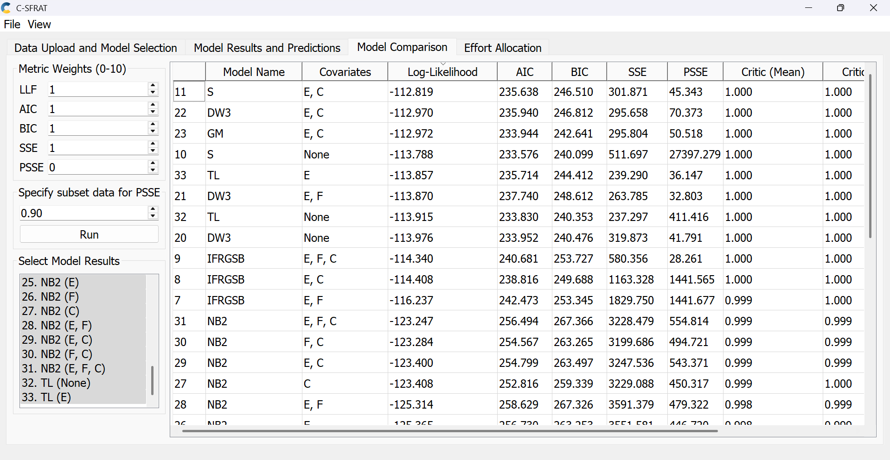
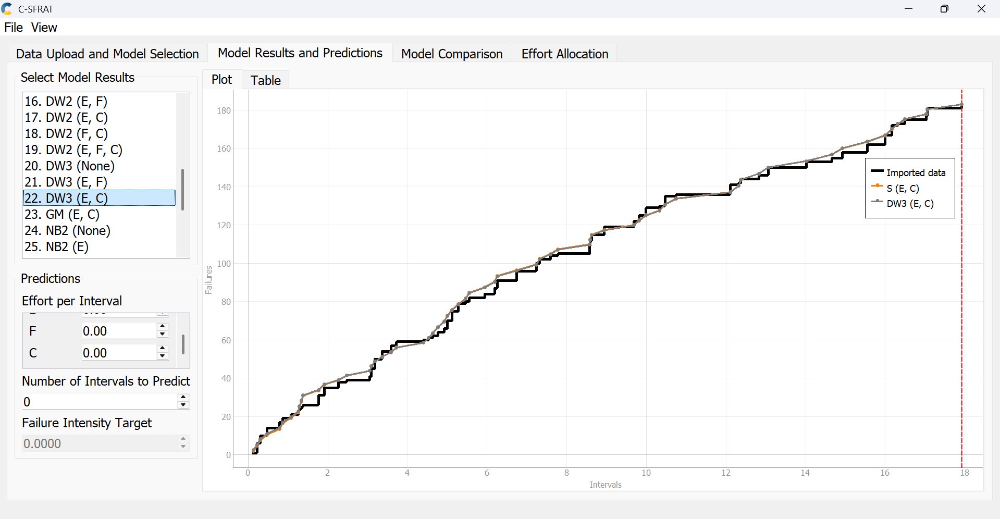
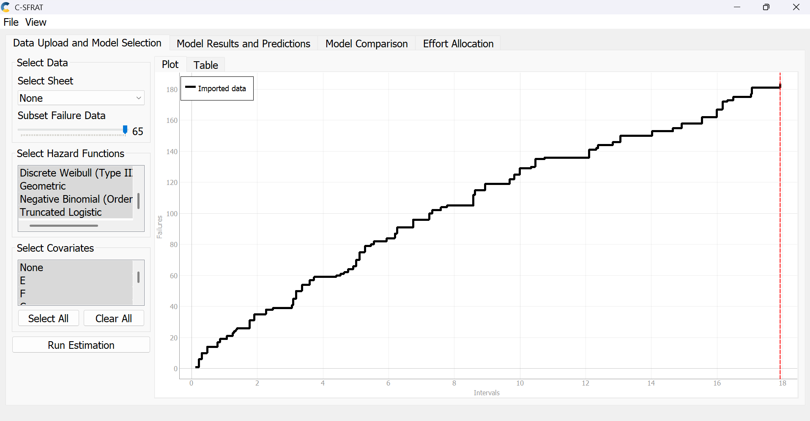
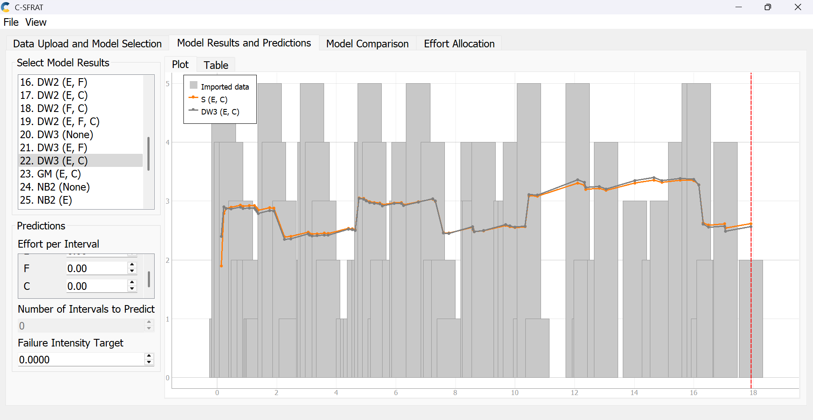
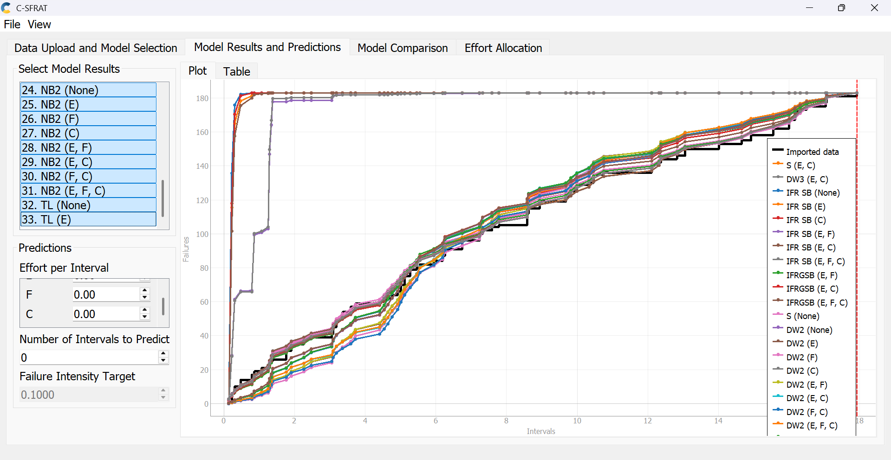
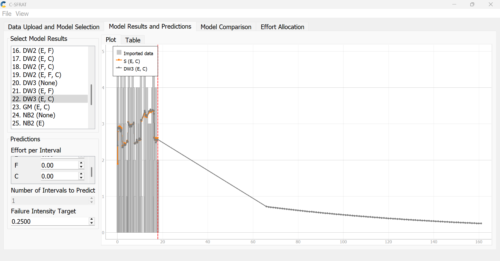
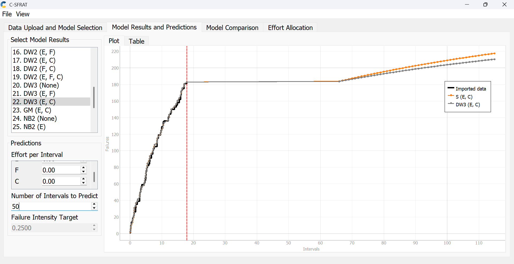

**SENG 438- Software Testing, Reliability, and Quality**

**Lab. Report \#5 – Software Reliability Assessment**

| Group \#:       |   |
|-----------------|---|
| Student Names:  |   |
|                 |   |
|                 |   |
|                 |   |

# Introduction

# Assessment Using Reliability Growth Testing 
In this section, we assess the reliability of the SUT using the Covariate Software Failure and Reliability Assessment Tool (C-SFRAT) with the "failure report 2" dataset. The analysis involves comparing reliability models, identifying suitable data ranges for analysis, plotting failure rate and reliability, making decisions based on a target failure rate, and discussing the advantages and disadvantages of reliability growth testing.

### Result of Model Comparison (Selecting Top Two Models)
To evaluate the reliability growth of the SUT, we ran multiple reliability models in C-SFRAT using the "failure report 2" dataset as the input with covariates E (execution time), F (failure identification work), and C (computer time for failure identification). The model comparison results are shown in the table in:

The models were ranked based on their Log-Likelihood values, with lower values indicating a better fit to the observed failure data.

The top two models identified based on the lowest Log-Likelihood values are:
- S (E, C): This model, with covariates E and C, achieved the lowest Log-Likelihood of -112.819, indicating the best fit to the failure data. Its AIC is 235.638, BIC is 246.510, SSE is 301.871, and PSSE is 45.343, with a Critic score of 1.000.
- DW3 (E, C): This model, also with covariates E and C, ranked second with a Log-Likelihood of -112.970. Its AIC is 235.940, BIC is 246.812, SSE is 295.658, and PSSE is 70.373, also with a Critic Mean and Median score of 1.000.

The S (E, C) and DW3 (E, C) models were selected for further analysis due to there low Log-Likelihood values, indicating the best fits to the observed failure data. The plot in: 

 

shows the cumulative failures predicted by the top models (S (E, C) and DW3 (E, C)) compared to the imported data, confirming their close alignment with the observed failure trends.

### Result of Range Analysis

The image above displays the imported failure data, which is composed of 65 subsets over 18 intervals. The cumulative failures first increase sharply before growing more slowly in the end. The failure intensity plot:

which shows the failure intensity per interval for the S (E, C) and DW3 (E, C) models along with the imported data, was analyzed to identify the appropriate range for reliability growth analysis.

<!-- The failure intensity is highest in the early intervals (0 to 4), peaking around interval 2, indicating a high rate of defect discovery during the initial testing phase. From interval 5 onwards, the failure intensity decreases significantly and stabilizes, suggesting that the system is reaching a more reliable state as defects are identified and fixed. Therefore, the data from intervals 5 to 18 is most suitable for proceeding with reliability growth analysis, as it represents a period of stabilization where reliability growth models can more accurately predict future behavior. The early intervals (0 to 4) are less suitable due to the high variability and rapid defect discovery, which may skew the model predictions. -->

# Assessment Using Reliability Demonstration Chart 

# Comparison of Results

# Discussion on Similarity and Differences of the Two Techniques

# How the team work/effort was divided and managed
We followed a similar division of work as in our previous assignments, with Rohan and Wade focusing on the Reliability Demonstration Chart section, while Sukriti and Sahib worked on the Reliability Growth Testing. All team members actively contributed by assisting each other with roadblocks and providing support whenever needed. Overall, we believe the workload was shared fairly evenly among the four of us, and everything was completed on time without the need for additional reminders or assistance from outside the group.

# Difficulties encountered, challenges overcome, and lessons learned
Both teams encountered significant difficulties while working on their respective sections of the lab. For the team working on the Reliability Growth Testing, the primary challenge was running the C-SFRAT software tool. The program frequently crashed whenever any parameters such as intervals or the failure intensity target was modified. This led to considerable frustration and time loss, as we often had to restart the program and re-import the data from scratch. Additionally, there was a noticeable lack of guidance or resources on how to generate the required plots, which forced us to rely on trial and error and our own judgment to complete this part of the assignment.

The team working on the Reliability Demonstration Chart section also faced obstacles. Certain spreadsheet cells that were supposed to be editable were locked and marked as unchangeable, which caused confusion during data input. Furthermore, there was uncertainty regarding the accuracy of the generated plots, and even the TAs were unsure about some aspects, leading to uncertainity when submitting the assignment. Despite these setbacks, teamwork played a key role in helping us navigate through most of the difficulties. This collaborative effort enabled us to complete the assignment to the best of our abilities.

# Comments/feedback on the lab itself
Compared to the previous labs, this assignment lacked clear and detailed instructions. The guidance on how to use the C-SFRAT software and how to properly generate the required plots was particularly unclear. Additionally, there were numerous failure datasets provided, and selecting the most appropriate one for producing meaningful graphs proved to be a challenge. More structured instructions and clarity around these aspects would have made the assignment smoother and less time-consuming.
