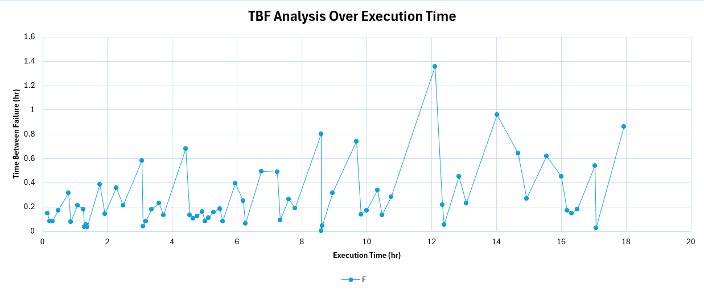
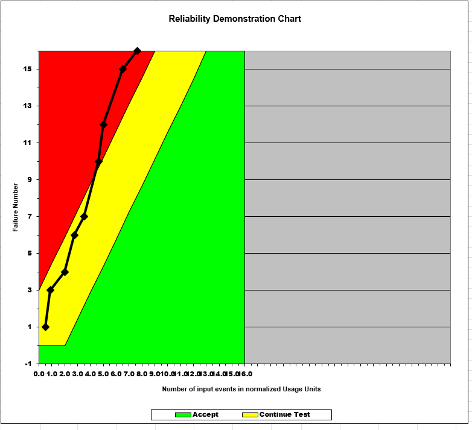
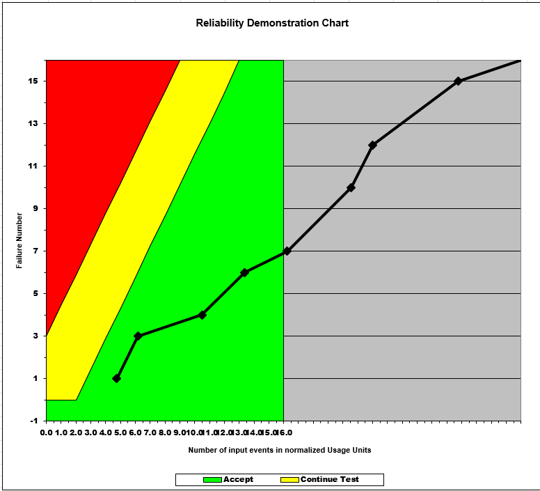

**SENG 438- Software Testing, Reliability, and Quality**

**Lab. Report \#5 – Software Reliability Assessment**

| Group \#:       | 16  |
|-----------------|---|
| Student Names:  | Sahib Singh Thethi  |
|                 | Sukriti Badhwar  |
|                 | Rohan Lange  |
|                 | Wade Banman  |

# Introduction
In this assignment we were able to look at different ways to highlight failure data for a given SUT. This is proven very useful as we can see how robust our System is and at what points the reliability can weaken.

For this assignment, we looked at Reliability Growth testing by using C-SFRAT for a SUT. 
This tool creates multiple models which allows us to compare and select which would be best for our data.
We also look over the range analysis of our data which allows us to highlight failure intensities at given points in the SUT

Then, we will plot failure rate and reliabilty of the SUT using the same tool. This is a great way to visualize failures over larger and larger intervals.

Finally we will show off new data over Reliability Demonstration Chart, this takes cumulative failure count over a set time to visualize the intensity of failures over time. Given both of these methods we will compare and contrast the benefits and drawbacks.

# Assessment Using Reliability Growth Testing 
In this section, we assess the reliability of the SUT using the Covariate Software Failure and Reliability Assessment Tool (C-SFRAT) with the "failure report 2" dataset. The analysis involves comparing reliability models, identifying suitable data ranges for analysis, plotting failure rate and reliability, making decisions based on a target failure rate, and discussing the advantages and disadvantages of reliability growth testing.

This image illustrates the results obtained after executing all models with all covariates, enabling us to identify the models that best fit our input data.

### Result of Model Comparison (Selecting Top Two Models)
To evaluate the reliability growth of the SUT, we ran multiple reliability models in C-SFRAT using the "failure report 2" dataset as the input with covariates E (execution time), F (failure identification work), and C (computer time for failure identification). The model comparison results are shown in the table in:

The models were ranked based on their Log-Likelihood values, with lower values indicating a better fit to the observed failure data.

The top two models identified based on the lowest Log-Likelihood values are:
- S (E, C): This model, with covariates E and C, achieved the lowest Log-Likelihood of -112.819, indicating the best fit to the failure data. Its AIC is 235.638, BIC is 246.510, SSE is 301.871, and PSSE is 45.343, with a Critic score of 1.000.
- DW3 (E, C): This model, also with covariates E and C, ranked second with a Log-Likelihood of -112.970. Its AIC is 235.940, BIC is 246.812, SSE is 295.658, and PSSE is 70.373, also with a Critic Mean and Median score of 1.000.

The S (E, C) and DW3 (E, C) models were selected for further analysis due to there low Log-Likelihood values, indicating the best fits to the observed failure data. The plot in: 

 

shows the cumulative failures predicted by the top models (S (E, C) and DW3 (E, C)) compared to the imported data, confirming their close alignment with the observed failure trends.

### Result of Range Analysis

The image above displays the imported failure data, which is composed of 65 subsets over 18 intervals. The cumulative failures first increase sharply before growing more slowly in the end. The failure intensity plot:

which shows the failure intensity per interval for the S (E, C) and DW3 (E, C) models along with the imported data, was analyzed to identify the appropriate range for reliability growth analysis.

The failure intensity is highest in the early intervals (0 to 2), peaking around interval 1 with approximately 5 failures per interval, indicating a high rate of defect discovery during the initial testing phase. From interval 3 to 10, the failure intensity fluctuates between 2 to 4 failures per interval, showing some variability but a general downward trend. After interval 10, the failure intensity remains between 2 and 4 failures per interval, gradually declining toward 2 by the later intervals, suggesting that the system is reaching a more reliable state as defects are identified and fixed. Therefore, the data from intervals 10 to 18 is most suitable for proceeding with reliability growth analysis, as it reflects a lower and more stable range of failure intensity. The early intervals (0 to 9) are less suitable due to the high variability and rapid defect discovery, which may skew model predictions.

### Plots for Failure Rate and Reliability of the SUT
Failure Intensity:

Failure Target:

Reliability Plot (50 Predicted Intervals):

Time Between Failures Plot:

### Discussion on Decision Making Given a Target Failure Rate
The target failure rate for the SUT was set to 0.2500 failures per interval, as depicted in the attached plot. Initially, during intervals 0 to 2, the failure intensity is significantly higher than the target, peaking around 5 failures per interval. Following interval 2, the failure intensity shows fluctuations yet generally stays within approximately 2 to 4 failures per interval until interval 18 (end of observed data). After interval 18, the predicted failure intensity steadily decreases, ultimately falling below the targeted threshold of 0.2500 failures per interval around interval 60 and remaining below this target thereafter.

Based on this assessment, the SUT clearly does not meet the target failure rate during the early testing phase (intervals 0–18). This indicates that the system is not sufficiently reliable for immediate deployment. The SUT, however, is predicted to achieve and sustain the desired reliability level after around 60 intervals, assuming continued defect correction and consistent reliability improvement.
This concludes that at least 60 intervals of testing and corrective actions are required to meet the stated reliability objectives. Deploying the system prior to this point would likely require additional defect mitigation strategies or enhanced testing processes to accelerate reliability improvement.

The reliability plot, also previously attached,  further reinforces this analysis, as it shows cumulative failures increasing slowly and steadily after interval 18, signifying a stable improvement in reliability over the projected intervals.

### Advantages and Disadvantages of Reliability Growth Analysis
The advantages of Reliability Growth Analysis are:
- Predictive Capability: Enables teams the ability to predict future dependability using past failure data, facilitating the early detection of possible problems and remedial action.
- Effective Resource Management: Enables the focused distribution of testing and debugging activities, cutting down on wasteful spending and increasing productivity by concentrating resources on the system components or intervals that require the greatest attention.
- Objective Measurement of Reliability Improvement: Confirms the effectiveness of defect mitigation techniques, boosts stakeholder confidence, and offers transparent, measurable proof of improvements over time.

The disadvantages of Reliability Growth Analysis are:
- Data Quality Dependency: The availability, volume, and dependability of failure data have a major impact on accuracy and utility. Inadequate or subpar data can lead to inaccurate forecasts and poor decision-making.
- Model Sensitivity and Assumptions: The model assumptions (e.g., consistent debugging effectiveness and stable testing environments) heavily influence the results. Changes from these presumptions can have a significant effect on accuracy and undermine prediction confidence.
- Complexity and Potential for Misinterpretation: Reliability growth analysis frequently calls for complicated statistical modelling, which calls for specific expertise. Misuse or incorrect interpretation can result in less-than-ideal choices, like deploying systems too soon or allocating resources incorrectly.

# Assessment Using Reliability Demonstration Chart 

In this Section we tested the acceptability of Dataset2 using the RDC chart to determine wherethere the dataset was acceptable or not based on the number of failures present in a provided number of units. For this dataset we calculated the MTTF to be 74.1875 minutes and then adjusted the acceptable number of failures per time unit until the dataset was barely acceptable as depicted in the image below.

We then tried halving the MTTF which as depicted below rapidly brought the SUT to a state of rejection as it was failing far too often per minute and significantly under performing compared to the previous example

Finally we doubled the MTTF and plotted the data (depicted below) which resulted in a dramatically better SUT that was very comfortably accepted and significantly out performed the original SUT

Overall using the RDC to identify whether or not an SUT was acceptable based on its MTTF was a quick and easy method that greatly simplified the ability to identify wether or not the system under test was acheiving the desired results when provided the SUT's failure data

# Comparison of Results

Comparing the results of the Reliability Growth Testing (RGT) and Reliability Demonstration Charts (RDC) we can see that both methods of analysing reliability provide insight on common a common goal of reliability at a given time. While both methods can accomplish similar goals they both have situations where they should be applied. RDC can rapidly evaluate a system under test to determine whether or not it is matching expectations which can aid in making decisions with limited data however the usability doesn't go far beyond that. Using RGT we can take things a step further using statistical modeling to read into failure data and predict future reliabilites at given times that may not yet have been tested. While this method is more time consuming it can provide further insight onto a SUT and where and when improvements need to be made.

# Discussion on Similarity and Differences of the Two Techniques
There are notable similarities and differences between Reliability Growth Testing (RGT) and Reliability Demonstration Charts (RDC). Both methods use historical failure data collected during testing to evaluate software reliability. They provide visual outputs such as plots or charts, facilitating intuitive interpretation and decision-making for stakeholders. Furthermore, each technique aids in identifying whether the program satisfies predetermined reliability standards or requires additional testing.

Their intended use, level of complexity, and methodological approach, however, vary greatly. Throughout the software lifecycle, RGT uses predictive statistical modelling to forecast reliability growth, directing ongoing testing and debugging activities. It requires a high level of statistical expertise because it involves complex analysis and frequently incorporates covariates. On the other hand, RDC offers a simple visual representation that rapidly evaluates adherence to preset reliability goals, like Mean Time To Failure (MTTF). It is simpler, quicker to implement, and ideal for making rapid acceptability decisions with limited data.

In reality combining the two approaches can be very advantageous. RDC's simplicity and clarity enable prompt and dependable decision-making, while RGT offers comprehensive predictive insights useful for overseeing continuous testing procedures. Using both guarantees a thorough and impartial reliability assessment method.

# How the team work/effort was divided and managed
We followed a similar division of work as in our previous assignments, with Rohan and Wade focusing on the Reliability Demonstration Chart section, while Sukriti and Sahib worked on the Reliability Growth Testing. All team members actively contributed by assisting each other with roadblocks and providing support whenever needed. Overall, we believe the workload was shared fairly evenly among the four of us, and everything was completed on time without the need for additional reminders or assistance from outside the group.

# Difficulties encountered, challenges overcome, and lessons learned
Both teams encountered significant difficulties while working on their respective sections of the lab. For the team working on the Reliability Growth Testing, the primary challenge was running the C-SFRAT software tool. The program frequently crashed whenever any parameters such as intervals or the failure intensity target was modified. This led to considerable frustration and time loss, as we often had to restart the program and re-import the data from scratch. Additionally, there was a noticeable lack of guidance or resources on how to generate the required plots, which forced us to rely on trial and error and our own judgment to complete this part of the assignment.

The team working on the Reliability Demonstration Chart section also faced obstacles. Certain spreadsheet cells that were supposed to be editable were locked and marked as unchangeable, which caused confusion during data input. Furthermore, there was uncertainty regarding the accuracy of the generated plots, and even the TAs were unsure about some aspects, leading to uncertainity when submitting the assignment. Despite these setbacks, teamwork played a key role in helping us navigate through most of the difficulties. This collaborative effort enabled us to complete the assignment to the best of our abilities.

# Comments/feedback on the lab itself
Compared to the previous labs, this assignment lacked clear and detailed instructions. The guidance on how to use the C-SFRAT software and how to properly generate the required plots was particularly unclear. Additionally, there were numerous failure datasets provided, and selecting the most appropriate one for producing meaningful graphs proved to be a challenge. More structured instructions and clarity around these aspects would have made the assignment smoother and less time-consuming.
